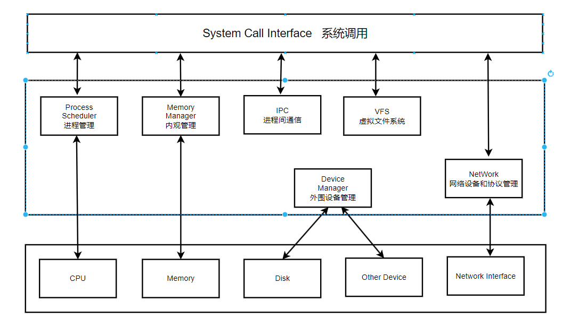

# 内核组织结构

## 1.Linux源码结构
Linux版本号 x-x-x: 发布的内核主版本:次版本号(偶数稳定版/奇数开发板):错误修补的测数

arch:  不同平台体系代码位置(x86 amd mips)
block: 块设备驱动(磁盘/CD-ROM硬件存储介质),连接了块设备和用户空间，实现了用户空间对磁盘大块数据的访问。以块方式，接收发送数据，IDE/HPA。(2.6以前 driver+VFS)
certs: 认证签名相关代码
crypro:内核常用加密压缩算法
documentation: 描述模块功能和协议规范
drivers:驱动程序，USB总线，PCI总线，显卡等驱动程序
firmware: 二进制固件(CPU)
fs: 虚拟文件系统
include: 内核源码依赖绝大部分头文件
init: 内核初始化代码，联系到内核组件入口
ipc: 进程间通讯实现，共享内存，信号量，管道。
kernel: 内核核心代码，进程管理，IRQ，时间等
lib: C标准库的子集
mm:  内存管理相关实现
net: 网络协议相关代码,TCP,IPV6,WIFI
samples:内核示例代码
scripts:编译和配置内核所需脚本
security:内核安全模块相关代码
sound: 声卡驱动
tools:和内核交互的工具，用户态测试内核功能
usr: 用户打包和压缩内核实现源码
virt: 虚拟化目录
COPYING: 许可授权信息
CREDITS：贡献者列表
KBuild: 内核编译系统
Kconfig: 配置内核所使用的文件
MAINTAINERS: 目前维护者列表
Makefile:编译内核的主要文件

## 2.Linux操作系统结构
Linux内核时操作系统的一部分，对下管理系统所有硬件设备，对上通过系统调用向Library Runtime(C语言库)或者其他程序提供API接口
内核的作用，承上启下。管理硬件设备，提供给应用程序使用
application -> library routine -> kernel -> hardware

1. 进程调度:
- 控制进程对CPU的访问,在选择下一个需要运行的程序时，选择优先级最高的进程
2. 进程间通信:
- 进程间通信方式
3. 虚拟文件系统
- 隐藏不同硬件的具体细节，为所有设备提供统一接口。(虚拟文件系统/硬件驱动程序)
4. 内存管理
- 允许多个进程，安全的共享主存储区
5. 网络接口
- 对标准网络协议和硬件的支持

用户进程->系统调用(API)(Linux系统调用也是内核部分)->Linux内核->驱动程序->硬件设备

## 3.Linux内核特征
### 3.1 Linux内核组织形式为整体式结构，
- 整个内核由大量的过程组成，每个过程都是可以独立编译的，然后使用链接程序将他们连接在一起, 成为独立的目标程序。方便不同的人员，参与不同过程的开发。
- 可以说是宏内核，虽然采取了模块化，但是子模块内存地址没有隔离开。
- 内部结构简单，子系统容易访问。
- 开放式接口，允许改善，改进。
### 3.2 进程调度方式简单有效
- 业务进程：动态优先级调用方式
- 内核进程：中断服务程序，设备驱动程序，采用软中断机制，保证内核高效运行
- 设备交互：网卡DMA权限切换，硬中断
### 3.3 支持内核线程(守护进程)(用户进程)
- 后台运行
- 无终端，无登录shell
- 不会从内存中换出，效率高
- 
- 周期来完成特定的任务
- 连续运行等待特定事件触发
### 3.4 支持多平台虚拟内存管理(高移植性)
- 虚拟内存管理是和硬件强关联的
- 为了保持一致性，给不同的硬件平台提供了统一的接口
### 3.5 虚拟文件系统
- 为多种逻辑文件提供了统一的接口
- 为硬件设备也提供了统一的接口
### 3.6 模块化机制
- 内核模块独立，并且容易扩充
- 很容易增加新的驱动程序，不需要重新编译内核
- 方便在内核中安装或卸载能力，方便开发定义自定义内核
### 3.7 增加系统调用
- 一般是操作系统设计者提供给用户使用内核功能
- 允许设计自定义系统调用加入内核
### 3.8面向对象
- 网络部分面向对象编程思想，使得Linux支持多种协议，多种网卡驱动程序

## 4.Linux高频使用数据结构
1. task\_struct: 代表一个进程数据结构指针，形成一个系统任务链表
2. mm\_struct: 代表进程的虚拟内存
3. inode: 代表虚拟文件系统中的文件，目录等对应的索引节点

