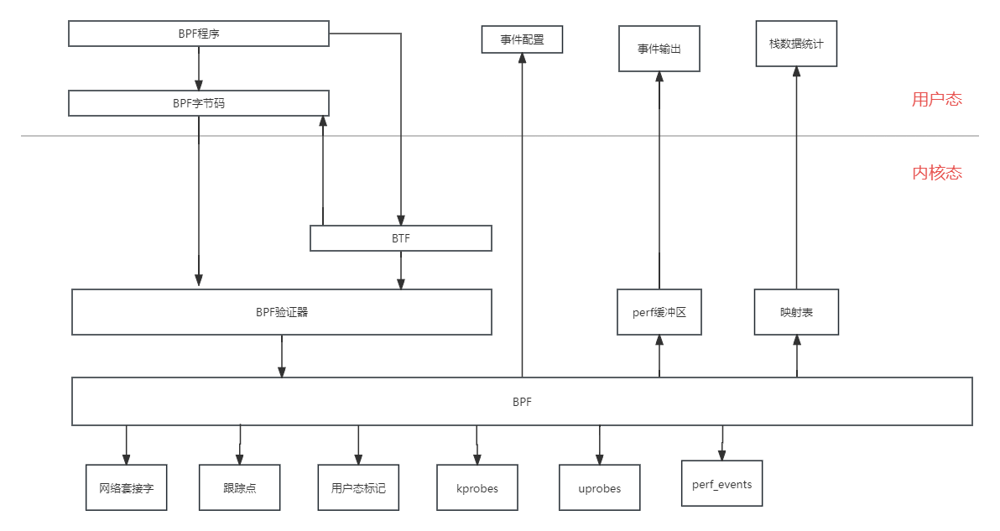

# BPF跟踪技术实现方案

# 1.BPF跟踪技术原理

# 2.BPF优势

# 2.1内存拷贝优势
1. 避免了将事件复制都用户空间并再次对其对其进行处理的成本，避免了对未使用的元数据字段复制

## 2.2BPF和内核模块比较
1. 提供了安全性检查，内核模块会引入内核崩溃
2. 映射提供丰富数据结构支持
3. 一次编译，多地运行
4. 不依赖内核编译过程中间结果
5. BPF程序原子性替换
6. 在模块中可以使用它其他内核函数和内核设施

# 3.BPF组成
# 3.1 bpftool
展示它所操作的BPF对象，
1. prog 程序
- bpftool prog dump jited id 263 显示JIT编译后的机器码
2. map 向映射表中读写数据
3. cgroup 操作cgroup
4. perf 查找和打印跟踪程序
5. net XDP
6. feature 列举BPF特性
7. btf 
- bpftool btf dump id 打印BTF的ID，BTF是BCC块IO完成事件的输出

# 3.2 BPF API
源码位置: include/uapi/linux/bpf.h
- bpf\_map\_lookup\_elem(map, key)
- bpf\_map\_update\_elem(map, key, value, flags)
- bpf\_map\_delete\_elem(map, key)
- bpf\_probe\_read(dst, size, src)
- bpf\_ktime\_getns() 系统启动的时长
- bpf\_trace\_printk() 输出TraceFS的trace{_pipe}文件写入调试信息
- bpf\_get\_current\_pid\_tgid() 高32位是TGID进程ID 低32位PID内核线程ID
- bpf\_get\_current\_comm(buf, buf\_size) 将任务名复制到缓冲区
- bpf\_perf\_event\_output(ctx, map, data, size)将数据写入perf\_event环形缓冲区
- bpf\_get\_stackid(ctx, map, flags) 获取用户态或内核态调用栈，返回标识符
- bpf\_get\_current\_task() 返回当前task结构体
- bpf\_probe\_read\_str(dst, size, ptr)
- bpf\_perf\_event\_read\_value(map, flags, buf, size)
- bpf\_get\_current\_cgroup\_id 返回当前的cgroupID
- bpf\_spin\_lock
- bpf\_spin\_unlock 对网络程序的并发控制
- bpf\_trace\_printk 向/sys/kernel/debug/tracing/trace\_pipe写数据

# 3.3 BPF系统调用
- BPF\_MAP\_CREATE
- BPF\_MAP\_LOOKUP\_ELEM
- BPF\_MAP\_UPDATE\_ELEM
- BPF\_MAP\_DELETE\_ELEM
- BPF\_MAP\_GET\_NEXT\_KEY
- BPF\_PROG\_LOAD 验证并加载BPF程序
- BPF\_PROG\_ATTACH
- BPF\_PROG\_DETACH
- BPF\_OBJ\_PIN 在/sys/fs/bpf下创建一个BPF对象实例

## 3.4 BPF程序类型(bpf\_prog\_type)
用于跟踪用途的BPF程序
BPF\_PROG\_TYPE\_KPROBE             用于动态插装点
BPF\_PROG\_TYPE\_TRACEPOINT         用于内核静态跟踪点
BPF\_PROG\_TYPE\_PERF\_EVENT        用于perf\_events，包括PMC
BPF\_PROG\_TYPE\_RAW\_TRACEPOINT    用于跟踪点，不处理参数

其他类型的程序
BPF\_PROG\_TYPE\_SOCKET\_FILTER     用于挂载到网络套接字
BPF\_PROG\_TYPE\_SCHED\_CLS         流量控制
BPF\_PROG\_TYPE\_TYPE\_XDP          XDP程序
BPF\_PROG\_TYPE\_CGROUP\_SKB        cgroup包过滤

## 3.5BPF映射表类类型
BPF\_MAP\_TYPE\_HASH                    基于HASH的映射表类型
BPF\_MAP\_TYPE\_ARRAY                   数组类型
BPF\_MAP\_TYPE\_PERF\_EVENT\_ARRAY      到perf\_events环形缓冲区的接口，用于将跟踪记录发送到用户空间
BPF\_MAP\_TYPE\_PERCPU\_HASH            一个基于每CPU单独维护更快HASH表
BPF\_MAP\_TYPE\_PERCPU\_ARRAY           一个基于每CPU单独维护的更快数组
BPF\_MAP\_TYPE\_STACK\_TRACE            调用栈存储，使用ID索引
BPF\_MAP\_TYPE\_STACK                   调用栈存储

## 3.6并发控制方案
per_cpu 每个CPU专用映射，避免冲突
互斥加 BPF\_XADD
映射原子更新
BPF自旋锁
5.1 引入了spin lock

## 3.7 BPF sysfs接口
BPF程序和映射通过虚拟文件系统暴漏，位于/sys/fs/bpf
用户态和读取和修改BPF映射表，用户态程序和正在运行的BPF程序交互，读取和修改BPF映射表
BTF通用的，描述所有内核数据结构的格式

## 3.8调用栈回溯
1. 调试信息
- 额外的调试信息以软件调试信息包形式提供, 包含了DWARF格式的ELF调试信息
- 包含了供gdb调用的栈信息
2. 最后分支记录LBR
- Intel处理器的特性 程序分支
3. ORC
- 回滚能力。
4. 调用栈回溯
- 保存基于帧指针或者ORC的调用栈回溯信息
- 帧指针技术: 函数调用栈帧链表的头部，始终保存在某个寄存器中
- 函数调用的返回地址始终保存在寄存器加固定偏移量

## 3.9火焰图
火焰图
时序火焰图
差分火焰图

## 3.10事件源
kprobe有黑名单，可能要禁止抢占和中断
1. kprobe
- 将要插桩的目标地址中的字节内容复制并保存(给单步断点指令出让位置)
- 以单步中断指令覆盖目标地址, X86\_64使用int3
- 指令执行到断点时，断点处理函数检查这个断点是否是kprobe注册，转到对应处理函数
- 原始指令流继续执行
- 不需要kprobe时，原始字节内容复制回原始地址，恢复初始形态
2. Ftrace
- 将处理函数注册为对应函数的Ftrace处理器
- 函数起始处执行内建入口时，调用Ftrace，掉kprobe处理函数
- kprobe不再被使用时，一处Ftrace-kprobe处理函数
3. kretprobe
- 对函数入口kprobe插桩
- 入口命中，将返回地址保存替换成一个trampoline函数地址
- ret时，CPU交给trampoline
- kretprobe时，处理完成后返回之前的地址
- 不需要时，直接移除kprobe
4. 验证逻辑
(gdb) disas readline
插装
(gdb) disas readline
发现指令被替换
5. uprobe
b.attach_uprobe(name="C", sym="FunctionCall", fn_name="xxx", pid=args.pid)
6. tracepoints
cat /sys/kernel/debug/tracing/events/

- 格式 子系统:事件名
- 静态跳转补丁
- 内核编译阶段会在跟踪点插入不做任何工作指令，可以提替换成jump
- 函数尾部插入跟踪点函数，蹦床函数，遍历存储跟踪点探针回调函数数组
- RCU同步更新新的回调函数， 启动nop重写为jmp到静态跳转补丁
- 当跟踪器禁用某个跟踪点时，RCU删除跟踪器回调函数
- 最后一个回调删除就jmp重写为nop
- TRACEPOINT_PROBE(raw_syscalls, sys_enter)
7. RAW\_TRACEPOINT
BPF原始跟踪点
- 向跟踪点显示原始参数，避免需要创建稳定跟踪点参数导致的开销。
- 名字是稳定的，参数不稳定
- RAW_TRACEPOINT_PROBE(mm_compaction_suitable)

8. USDT(侵入明显)
- 用户态预定义静态跟踪
- 用户空间版的跟踪点机制
- #include"folly/tracing/StatucTracepoint.h"
- FOLLY\_SDT (provider, name, arg1, arg2)

9. 性能监控计数器
- PMC
- PIC 性能观测计数器
- CPC CPU性能计数器
- PMU 性能监控单元事件

- 活跃核心周期数
- 阻断执行指令数
- 活跃计时器周期数
- 末级缓存引用
- 末级缓存未命中
- 失效的跳转指令
- 失效的跳转未命中指令 
- PEBS 精确事件采样

10. perf\_events
- perf所依赖/
- BCC和bpftrace的缓冲区、
