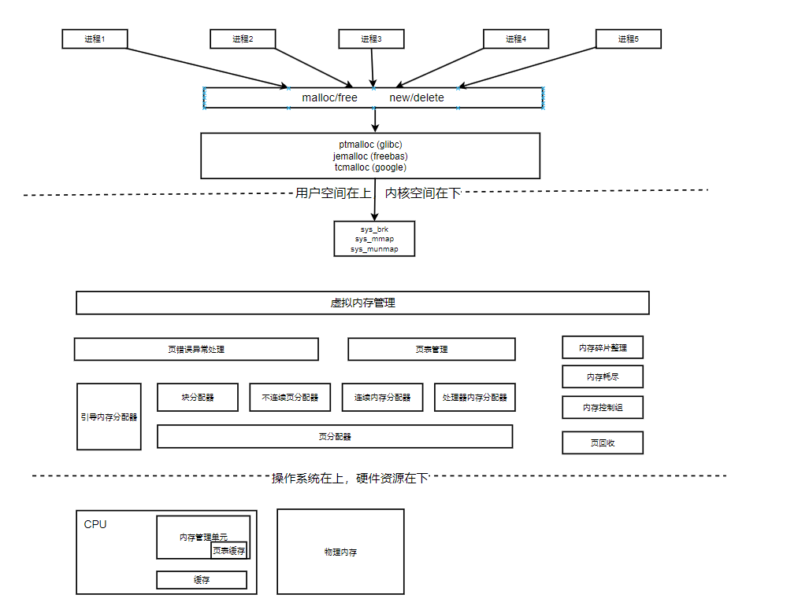

# 内存布局和管理架构(内核与用户态)

# 1. 内核内存布局
## 1.1 查看内核内存布局
cat /proc/cpuinfo | grep address 
address size 
- 64位Linux在查询后，会使用48位来表示虚拟地址空间，43位表示物理地址

cpuinfo 参数
- processor 系统中逻辑处理器的核的编号，超线程逻辑核心的编号
- vendor\_id CPU制造商信息
- family CPU序列的代号
- model CPU序列下某代产品
- model name CPU全称
- stepping CPU制作更新的版本
- fpu 浮点运算单元
- wp 当前CPU是否支持内核态对用户空间的写保护

## 1.2 查看内存使用状况
cat /proc/meminfo

meminfo参数
- memTotal 安装物理总容量数目
- memFree 当前未使用空闲内存量
- 

## 1.3 ARM64架构处理器寻址机制
采用48位物理寻址机制，虚拟地址同样也支持48位寻址。
- 最大可寻找256TB物理地址空间，虚拟地址寻址同样支持48位寻址
- 处理器架构上将内存划分为两个空间，用户空间和内核空间，都占用256TB
1. 用户空间 0x0000\_0000\_0000\_0000 到 0x0000\_ffff\_ffff\_ffff
2. 内核空间 0xffff\_0000\_0000\-0000 到 0xffff\_ffff\_ffff\_ffff
3. 虚拟地址和每个进程的页表映射，获取到真正的物理地址。不在物理地址中，就产生缺页中断，真正分配物理地址，更新进程页表。
4. 物理内存被耗尽，会根据内存替换算法，淘汰页面到物理磁盘
5. arm64 一般使用64KB页面，二级转换表，支持42位虚拟地址，4TB
6. 4KB页面会使用3级或者4级转换表，支持39位，512GB，支持48位，256TB虚拟地址。

# 2  用户空间和内核空间

## 2.1 内存管理架构

##  2.2 内核空间布局
1. 内核空间
- 线性映射区
- .data 数据段 内核初始化的全局变量
- .init 大部分模块的初始化数据，初始化结束，就是释放对应的内存
- .text 代码段 \_text代码段起始地址 \_etext代码段结束地址
- modules 128MB内核模块区域，内核模块使用的虚拟地址空间
- PCI I/O PCI设备I/O地址空间
- vmemmap 内存物理地址(不连续就会存在内存空洞),用于存放空洞内存的page结构的虚拟地址空间
- vmalloc 使用虚拟地址空间
- 非规范区域

2. 内核空间详解
源码地址 arch/arm64/include/memory.h
FFFF FFFF FFFF FFFF 线性映射区域 (PAGE\_OFFSET = 0xFFFF FFFF FFFF FFFF <<(VA\_BITS-1))
                    vmemmap区域 (VMEMMAP\_START = PAGE\_OFFSET - VMEMMAP\_SIZE)
                    2MB间隙
                    PCI I/O区域(16MB) (PCI\_IO\_END = VMEMMAP\_START - SZ\_2M) (PCI\_IO\_START = PCI\_IO\_END - SZ\_16M)
                    2MB间隙     （FIXADDR\_TOP = PCI\_IO\START - SZ\_2M）
                    固定映射区域  (FIXADDR\_START = FIXADDR\_TOP - FIXADDR\_SIZE)
                    间隙         (VMALLOC\_END = PAGE\_OFFSET-PUB\_SIZE-VEMMAP\_SIZE-SZ\_64K)
                    内核镜像       (KIMAGE\_VADDR+TEXT\_OFFSET)
                    内核模块区域    (VMALLOC\_START = MODULES\_END = MODULES\_VADDR+SZ\_128M)
                    KASAN影子区域   (MODULES\_VADDR = VA\_START + KASAN\_SHADOW\_SIZE)
                                    (VA\_START = 0xFFFF FFFF FFFF FFFF) << VA\_BITS
KASAN 动态内存错误检查 1/8 内存
释放后使用和越界两类错误

# 3.内存管理架构
内存管理子系统可以分为 用户空间、内核空间、硬件部分

1. 用户空间
- malloc申请内存资源， free释放内存资源
- 是glibc库的内存分配器ptmalloc提供的接口
- ptmalloc 使用系统调用 brk或者mmap，向内核以页为单位申请内存，分成小块分配给进程
2. 内核空间
- 内核总是驻留内存中，操作系统的一部分。
- 内核空间为内核保留，不允许直接读取该区域或调用内核代码定义的函数
- 虚拟内存管理负责从进程的虚拟地址空间，分配虚拟页
- sys\_brk 扩大或收缩堆
- sys\_mmap 内存映射区域，直接分配对应的虚拟页
- sys\_munmap 释放分配的虚拟页
- 页分配器负责分配物理页，现在使用伙伴分配器
- 不连续页分配器 分配内存vmalloc 释放内存vfree，在内存碎片多时生效。申请不连续物理页，映射到连续虚拟页
- 内存控制组，控制进程所占用的内存。内存碎片化，找不到连续物理页，就是用内存碎片整理
- 内存碎片整理，通过迁移方式，得到连续的物理页
- 页回收，内存不足时，负责回收物理页。数据会写到块设备，将数据放到交换区，然后释放物理页。内存不足，回收失败，就会OOM。

3. 硬件
- 处理器包含一个内存管理单元MMU(Memory Management Uint)部件
- MMU(内存管理单元)负责把虚拟地址转化成物理地址
- TLB(页表缓存)，保存最近使用过页表的映射，避免每次虚拟地址转换为物理地址的查询页表是否存在。
- 解决处理器执行速度和内存速度不匹配
- 一级缓存分为指令缓存和数据缓存

4. 系统调用过程
- 用户态 malloc内存分配
- 系统调用 sbrk/brk  mmap/munmap
- 内核态 kmalloc/vmalloc

# 4. 虚拟地址空间布局架构
目前没有超大内存需求，ARM64暂时不支持完全64位虚拟地址
- ARM64下，内核虚拟地址和用户虚拟地址宽度相同(48位 128TB)
- 进程共享内核虚拟地址空间，进程本身用户虚拟地址空间独立。
- 线程组用户线程共享虚拟地址空间
- 内核线程没有用户虚拟地址空间

## 4.1 ARM64内核用户虚拟地址空间划分
1. ffff ffff ffff ffff 内核地址空间     
2. ffff 0000 0000 0000 不规范地址空间结束
3. 0000 ffff ffff ffff 不规范地址空间起始       
4. 0000 0000 0000 0000 用户地址空间

## 4.2 用户虚拟地址空间划分
源码位置 arch/arm64/asm/memory.h
- 进程的用户虚拟空间起始地址为0 长度为TASK\_SIZE 每种处理器架构定义自己的TASK\_SIZE
- ARM64 32位 TASK\_SIZE\_32 4GB    0x100000000
- ARM64 64位 TASK\_SIZE\_64 128TB  VA\_BITS(编译内核时，选择的虚拟地址的位数)

## 4.3 用户虚拟地址空间内容
1. 代码段、数据段、未初始化数据段、只读数据段
2. 堆
3. 共享库
4. 栈
5. 命令行和环境变量
6. 文件区间映射到虚拟地址空间内存映射区