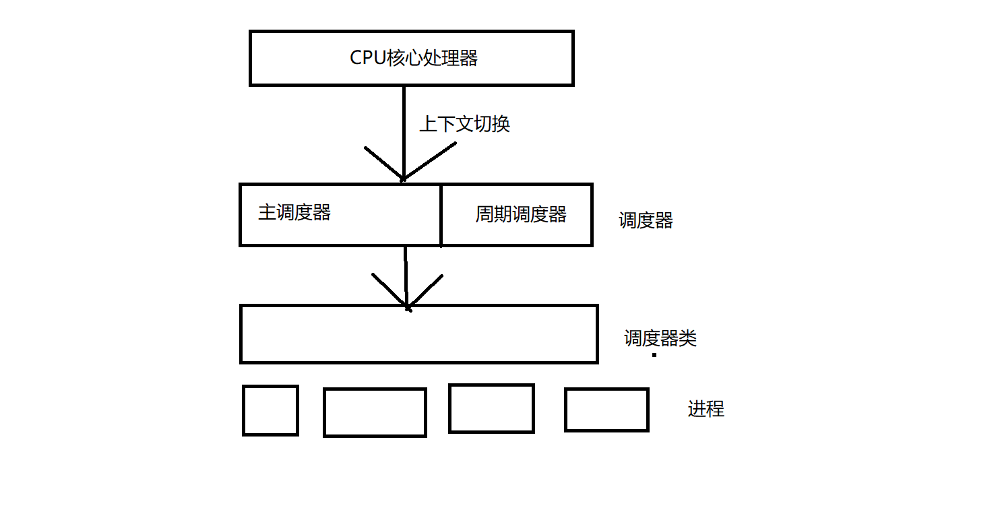

# 调度器类

# 1.完全公平调度器CFS
## 1.1 完全公平调度类CFS算法基本原理
1. 特点
- 对待每个进程都是公平的，让每个进程运行一段相同的时间。基于时间片轮转(轮询)调度算法
- cfs\_rq CFS的就绪队列中，每一个进程设置一个虚拟时钟, virtual runtime(vruntime) 进程执行随着时间增加，vruntime也将不断增加，不执行保持不变
2. 问题
- 不能按照特定的时间权重运行
- 如果每次调度都要遍历运行队列中所有的进程-  时间复杂度为O(n)，不合理

## 1.2 如何实现完全公平调度算法
为了实现完全公平调度算法，为进程定义两个时间
1. 实际运行时间: 
- 调度周期\*进程权重/所有进程权重之和
- 调度周期: 所有进程运行一遍需要的时间
- 进程权重: 根据进程重要性，分配给每个进程不同的权重
2. 虚拟运行时间:
- 实际运行时间\*nice值为0的进程权重/该进程权重 = 
- 调度周期\*进程权重/所有进程权重之和\*nice值为0的进程权重/该进程权重

在一个调度周期内，所有进程的虚拟运行时间的长度是相同的

## 1.2调度器结构分析
为了保证多任务下，可以合理使用CPU资源，我们需要一个硬件资源管理单元，调度器诞生了，用来决定下一次是谁使用CPU

- 任务： 合理分配CPU时间给运行进程，同时执行多个进程成为可能，在多个进程间共享CPU还要考虑优先级
- 重要目标：合理、有效、分配CPU
- CPU调度器结构

- 主调度器: 调用schedule完成进程切换和选择
- 周期调度器：根据频率自动调用scheduler\_tick，作用根据进程运行时间触发调度
- 上下文切换：
1. 切换地址空间
2. 切换寄存器和栈

## 1.3 完全公平调度器CFS数据结构
源码位置: kernel/sched/fair.c
next 下一个进程(下一个优先调度类)
enqueue\_task 调度进程进入红黑树(就绪队列) 
dequeue\_task 从红黑树中删除进程

## 1.4完全公平调度器CFS就绪队列
CFS的顶级调度队列struct cfs\_rq
源码位置: kernel/sched/sched.h

进程调度是从调度队列开始的，但是具体是由各个调度器管理的
就绪队列中就有各种调度器的数据结构

struct cfs\_rq
- CFS调度运行队列，每个CPU的RQ会包含一个cfs\_rq 每个组调度的sched\_entity也会有一个cfs\_rq队列
1. struct load\_weigh load CFS运行队列中所有进程的的总负载是多少
2. unsigned int nr\_running CFS运行队列中调度实体的数量
3. unsigned int h\_nr\_running 只对进程有效 当前层级以及所有子层级下task se的个数和，不包括group se。
4. struct rb\_root tasks\_timeline 红黑树的root 用于在按时间排序的红黑树中管理所有进程
5. struct rb\_node \*rb\_leftmost 红黑树最左调度实体(下一个调度节点)
6. struct task\_group \*tg 拥有CFS运行队列的进程组
7. u64 min\_vruntime 跟踪记录，队列上所有进程的最小虚拟运行时，虚拟时钟
8. struct sched\_entity 
- \*curr 当前正在运行调度实体 
- \*next 某些实体需要运行
- \*last
- \*skip 跳过进程，不选择他调度

