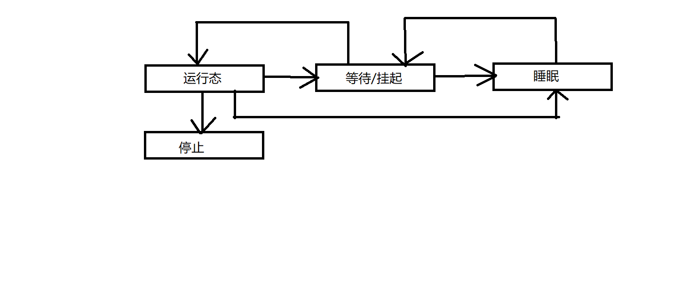

# 1.进程
## 1.1进程的描述
- OS是硬件的使用层，提供使用硬件资源的能力
- 进程是OS的使用层，提供使用OS抽象出的资源层的能力

进程：计算机中正在运行的程序，进程不是基本的运行单元，是线程的容器

- 程序源代码：指令+数据+组织形式
- 进程：指令和数据运行的示例

## 1.2进程要素
要被称为一个进程
1. 有一段代码构成了可执行文件
2. 有进程专用的系统堆栈空间
3. 在内核有task\_struct数据结构描述
4. 有独立的虚拟内存空间(用户态)
1+2+3 = 线程
1+2+3+4 = 进程
完全没有用户空间 = 内核线程
共享用户空间 = 用户线程

## 1.3进程创建
创建进程的时候，内核未进程分配task\_struct的时候，实际上分配了两个连续的物理页,属于task_struct这个结构
这个结构上面，用于这个结构的系统空间堆栈
task\_struct = 1K
系统堆栈空间 = 7K(静态确定，不能更改)

## 1.4task\_struct
记录了运行需要的各种资源，例：打开的文件描述符，挂起的信号量，内核内部数据处理器状态等
双向循环链表存储，通过唯一PID标识每个进程

## 1.5进程的创建过程
- 第一步:拷贝一个当前进程，创建一个子进程
- 第二步:读入可执行文件，纳入地址空间开始运行
- COW：写时拷贝，避免无用开销

## 1.6进程生命周期及状态间的转换
多任务操作系统，每个进程分时复用CPU时间片，通过进程调度策略实现多任务并行。
- 运行:程序正在执行
- 等待:进程能够运行，但是没有许可，调度器下次切换可选择
- 睡眠:等待外部事件，无法运行，调度器无法选择。进程不是总是能一直运行，有时需要等待外部不确定的信号源

## 1.7进程表
操作系统把所有的进程，都保存在进程表中
- 孤儿进程:父进程退出，子进程还在运行，子进程被init进程收养，完成状态收集工作
- 僵尸进程:子进程退出，父进程没有获取子进程状态信息，子进程描述符，依然保持在操作系统中

- 僵尸进程:

