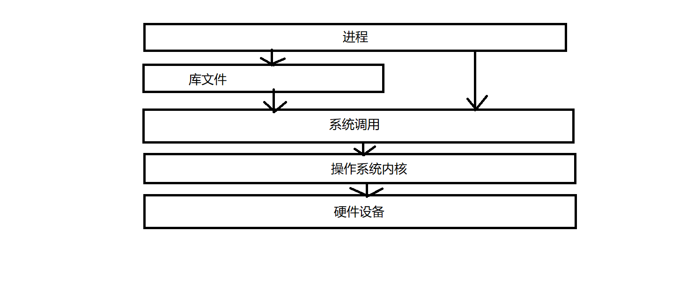

# 1.进程系统调用
fork/exec 系列系统调用，不是由应用程序发出的，而是通过了中间层调用，与内核通信的C标准库。从用户态i企鹅换到核心态

# 1.1 进程复制
1. fork: 重量级系统调用，建立父进程副本，作为子进程执行，Linux为了避免小号，使用了COW
2. vfork:不创建父进程数据副本，父子进程共享数据，节省CPU时间
3. clone::产生线程，对父子进程共享，复制精准控制

# 1.2 实现方案
1. 写时复制
- 防止fork执行时将所有数据复制到子进程
- 调用fork 内核会对父进程的每个内存页，都为子进程创建一个副本
- 避免一次拷贝大量数据给子进程，造成拥塞问题
- 必要内容会拷贝，页表，虚拟内存和物理内存的映射索引表(内存页表越大，阻塞fork的时间越长),拷贝结束后，指向了相同的地址空间
- 父子进程会在修改页内容时分离
- 内核只为新生成的子进程创建虚拟空间结构，他们来复制位于父进程的虚拟结构，不为这段分配物理内存。
2. 执行系统调用
- fork 系统调用 sys\_fork
- vfork 系统调用 sys\_vfork
- clone 系统调用 sys\_clone
3. do\_fork实现
- 三个创建进程的操作，最终都会调用kernel/fork.c里面的do\_fork
- copy\_process 创建新进程
- 重用父进程内容
- wake\_up\_new\_task 

# 1.3 do\_fork 源码分析
源码位置: kernel/fork.c
long do\_fork
1. arg1: unsigned long clone\_flags: 控制克隆过程的标志位
2. arg2: unsigned long stack\_start: 用户状态下,栈的起始地址
3. arg3: unsigned long stack\_size: 用户状态下栈的大小
4. arg4: int \_\_user \* parent\_tidptr: 指向父进程指针
5. arg5: int \_\_user \* child\_tidptr: 指向子进程指针

# 2.内核线程
直接由内核本身启动的进程,将内核函数委托给独立的进程，在系统中和其他进程并行
- 周期性修改内存页和页来源块设备同步 mmap
- 如果内存页很少使用，写入交换区
- 管理延时动作
- 实现文件系统事务日志

# 3.do\_exit.退出进程
源码位置: /kernel/exit.c
进程要使用exit终止，内核就有机会释放该进程使用的资源
内存的引用计数器归0，并且没有进程使用对应结构，就释放资源

